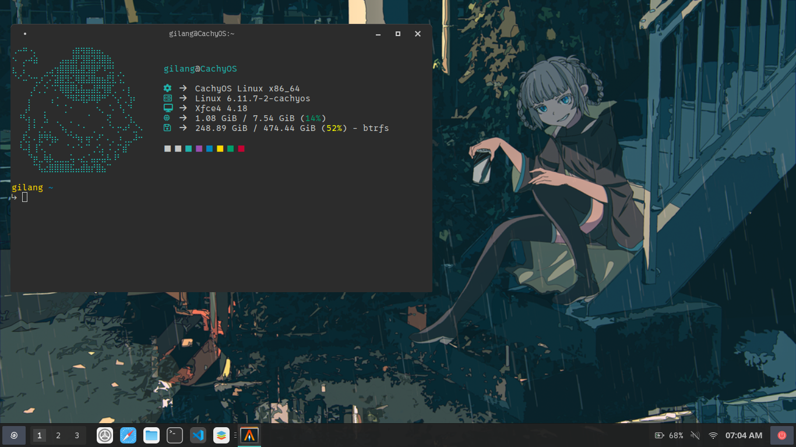

# XFCE4 Dotfiles



This repository contains configuration files (dotfiles) to set up a streamlined, visually appealing XFCE4 desktop environment. The goal is to provide a clean, functional, and personalized desktop experience.

## Features
- **XFCE4 Customization**: Includes configurations for panel layout, themes, and keyboard shortcuts.
    - **Themes**: Orchis-Teal-Dark-Compact
    - **Icons**: Colloid
    - **Cursor**: Bibata-Modern-Ice

## Installation
#### 1. Install Dependencies
You may need to install some XFCE4 components and optional packages. Use the following command on Arch-based systems:
```bash
# Terminal
sudo pacman -S zsh ttf-0xproto-nerd alacritty fastfetch

# XFCE4
sudo pacman -S xfce4 xfce4-battery-plugin xfce4-datetime-plugin xfce4-mount-plugin xfce4-notifyd xfce4-panel xfce4-power-manager xfce4-pulseaudio-plugin xfce4-screensaver xfce4-screenshooter xfce4-session xfce4-settings xfce4-taskmanager xfce4-whiskermenu-plugin xfce4-xkb-plugin 

# Thunar Plugin
sudo pacman -S thunar-archive-plugin thunar-media-tags-plugin
```

#### 2. Clone the Repository
Clone this repository to your home directory:
```bash
git clone https://github.com/gilangarya01/xfce-dotfiles.git
cd ~/xfce-dotfiles
```

#### 3. Copy or Rsync Dotfiles
```bash
cp -r ./ ~/
# or
rsync -av ./ ~/
```
Log out and log back in, or restart your system.


